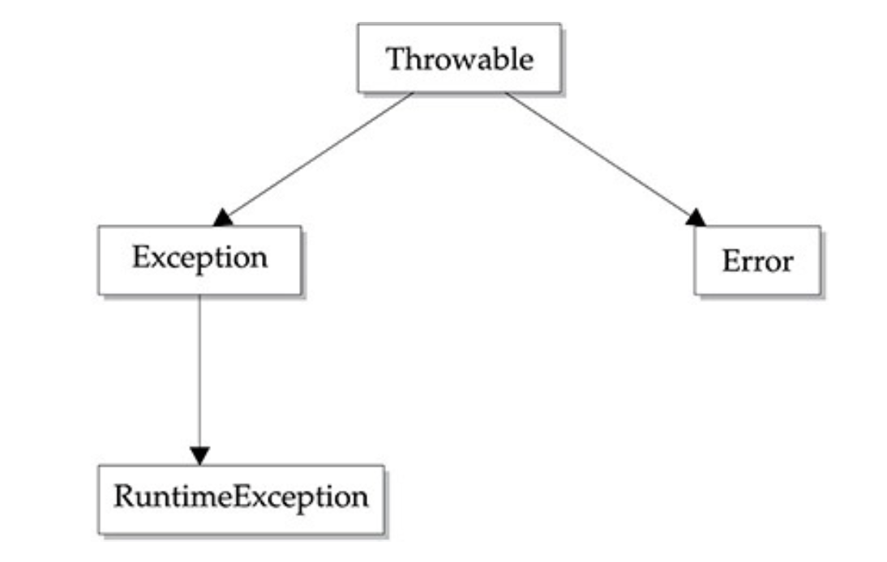

# **Exception Handling**


## **What is Exception in Java?**
- An exception is an abnormal condition that arises in a code sequence at run time. 
- It is an object which is thrown at runtime.


## **What is Exception Handling?**
- Exception Handling is a mechanism to handle runtime errors such as ClassNotFoundException, IOException, SQLException, RemoteException, etc.

## **Exception Handling Fundamentals**

- A Java exception is an object that describes an exceptional condition that has occurred in a piece of code. 

- When an exceptional condition arises, an object representing that exception is created and thrown in the method that caused the error. 


- The method may choose to handle the exception itself, or pass it on.

- Either way, at some point, the exception is caught and processed.

- Exceptions can be generated by the Java run-time system, or

- They can be manually generated by your code.


## **Advantage of Exception Handling**
- The core advantage of exception handling is to maintain the normal flow of the application.

### Java exception handling is managed via five keywords:
- try
- catch
- throw
- throws and finally. 

System generated exceptions are automatically `thrown` by the Java run-time system.

## `try`
- Program statements that you want to monitor for exceptions are contained within a try block. 

## catch
- If an exception occurs within the `try` block, it is thrown.
- Your code can catch this exception (using `catch`) and handle it in some rational manner.

## `throw`
- To manually throw an exception, use the keyword throw.

## `throws`
- Any exception that is thrown out of a method must be specified as such by a throws clause.

## `finally`
- Any code that absolutely must be executed after a try block completes is put in a finally block.


## An exception-handling block:

```java
try {
			
} catch (ArrayIndexOutOfBoundsException e) {
	System.out.println(e);
}catch(Exception e) {
	
}
finally {
	System.out.println("finally block");
}
```

---
## Hierarchy of Java Exception classes


- All exception types are subclasses of the built-in class **`Throwable`**.

- Thus, Throwable is at the top of the exception class hierarchy.

- Immediately below Throwable are two subclasses that partition exceptions into two distinct branches.

- **`Exception`**
- **`Error`**

## The top-level exception hierarchy 



## **`Exception`**
- Used for exceptional conditions that user programs should catch. 
- Superclass to create your own custom exception types.

### **`RuntimeException`** 
- An important subclass of Exception RuntimeException.
- Exceptions of this type are automatically defined for the programs that you write and include things such as division by zero and invalid array indexing.


## **`Error`**

- Error are used by the Java run-time system to indicate errors having to do with the run-time environment, itself. 

- Stack overflow is an example of such an error. 

- `Error` defines exceptions that are not expected to be caught under normal circumstances by your program.

--- 

## **Types of Java Exceptions**

- There are mainly two types of exceptions:
- checked and
-  unchecked.
- An error is considered as the unchecked exception.

###  According to Oracle, there are three types of exceptions namely:

- Checked Exception
- Unchecked Exception
- Error


##  Checked Vs Unchecked Exceptions
### Checked Exception
- Checked exceptions are unacceptable conditions that a programmer foresees at the time of writing a method.

- For an example, FileNotFoundException is a checked exception.

- Checked exceptions are so named because they’re checked during compilation.

- If a method call throws a checked exception, the compiler checks and ensures that the calling method is either handling the exception or declaring it to be rethrown.


### **`Runtime exceptions`**

- A runtime exception is a representation of a programming error. These occur from inappropriate use of a piece of code.
	- For example, `NullPointerException`
-  A runtime exception is a subclass of java.lang.RuntimeException.

- Together, runtime exceptions and errors are referred to as unchecked exceptions.

- ### Unchecked Exception

	- Unchecked exceptions = Runtime exception + Errors

	- For example, ArithmeticException, NullPointerException, ArrayIndexOutOfBoundsException, etc.

	- Unchecked exceptions are not checked at compile-time, but they are checked at runtime.


### Error

-  When the JVM throws errors these errors are considered to be serious exceptional conditions and they can’t be directly controlled by your code.
- `For example:`
	- NoClassDefFoundError 
	- StackOverflowError 
--- 

## **`The default exception handler`**

- Any exception that is not caught by your program will ultimately be processed by the default handler.

- The default handler displays a string describing the exception, prints a stack trace from the point at which the exception occurred, and terminates the program.

- The default exception handler shows how the entire call stack is displayed:

```java
int d=0;
int a = 42/d;
System.out.println(a);
```
---

## **Using `try and catch`**


### **`Try what?`**
- First, you try to execute your code. If it doesn’t execute as planned, you handle the exceptional conditions using a catch block.
### **`Catch what?`**
- You catch the exceptional event arising from the code enclosed within the try block and handle the event by defining appropriate exception handlers.

### **`What does finally do?`**
- Finally, you execute a set of code, in all conditions, regardless of whether the code in the try block throws any exceptions.


- The scope of the `catch` clause is restricted to those statements specified by the immediately preceding `try` statement.
- A `catch` statement cannot catch an exception thrown by another try statement.


### Syntax of Java try-catch
```java 
try{    
//code that may throw an exception    
}catch(Exception_class_Name ref){}

```

### Syntax of try-finally block
```java 
try{    
//code that may throw an exception    
}finally{} 
```
- You cannot use `try` on a single statement.

---

## **`Internal Working of Java try-catch block`**


- The JVM firstly checks whether the exception is handled or not.
- If exception is not handled, JVM provides a default exception handler that performs the following tasks:

	- Prints out exception description.
	- Prints the stack trace (Hierarchy of methods where the exception occurred).
	- Causes the program to terminate.

- But if the application programmer handles the exception, the normal flow of the application is maintained, i.e., rest of the code is executed.


---

### **Exception handling Example**
```java
try {
	int d=0;
	int a = 42/d;
	System.out.println("Will never print");
} catch (Exception e) {
	System.out.println("Exception" +e);
}
```


--- 

## **Multiple `catch` Clauses**


- You can specify two or more catch clauses, each catching a different type of exception.


```java 
try{    
     int a[]=new int[5];    
     a[5]=30/0;    
}
catch(ArithmeticException e){} //Arithmetic Exception occurs
catch(ArrayIndexOutOfBoundsException e){ }    
catch(Exception e) { }             
System.out.println("rest of the code");    
```

- Each catch statement is inspected in order, and the first one whose type matches that of the exception is executed.


```java
try{    
    int a[]=new int[5]; 
	System.out.println(a[10]);   
}
catch(ArithmeticException e) { 
    System.out.println("Arithmetic Exception occurs"); }    
catch(ArrayIndexOutOfBoundsException e)  {  
	// catch at this block 
    System.out.println("ArrayIndexOutOfBounds Exception occurs");}    
catch(Exception e) {  
    System.out.println("Parent Exception occurs");}
```

- If didn't provide the corresponding exception type the catch block containing the parent exception class Exception will invoked.

```java 
try{    
    String s=null;  
    System.out.println(s.length());    
}
catch(ArithmeticException e){} 
catch(ArrayIndexOutOfBoundsException e){ }    
catch(Exception e) { }// catch here since there is no corresponding.   
```


- After one catch statement executes, the others are bypassed, and execution continues after the `try/catch` block.


```java
    String[] student = {"Maung Maung","Aung Aung"};
    int grade=90;
    try {
    	double avg = grade/0;

    	student[10]="Kyawy Kyaw";

    } catch (ArrayIndexOutOfBoundsException e) {
    	System.out.println(e);
    }catch(Exception e) {
    	System.out.println(e);
    }
```

### **`important to remember :`**

- Exception subclasses must come before any of their superclasses.

-  A `catch` statement that uses a superclass will catch exceptions of that type plus any of its subclasses.

-  Thus, a subclass would never be reached if it came after its superclass.

```java
 try {}
 catch(Exception e) {}
 catch (ArrayIndexOutOfBoundsException e) {}
```
---

## **`Nested try Statements`**

- The try statement can be nested.

- That is, a try statement can be inside the block of another try.

```java
 try {
    //  some code
     try{
         // some code
     }
    catch (ArrayIndexOutOfBoundsException e) {}
 }
 catch(Exception e) {}
```

- Each time a try statement is entered, the context of that exception is pushed on the stack.

- If an inner try statement does not have a catch handler for a particular exception, the stack is unwound and the next try statement’s catch handlers are inspected for a match.

```java
try {
	try {
		int result =100/0;// handle by outer catch
	}catch(ArrayIndexOutOfBoundsException e) {
		// TODO: handle exception
	}
} catch (Exception e) {
	// TODO: handle exception
}
```

- This continues until one of the catch statements succeeds, or until all of the nested try statements are exhausted.

- If no catch statement matches, then the Java run-time system will handle the exception.

- Here is an example that uses nested try statements:


```java
doMath(1);
doMath(1,2);
public static void doMath(int ...args) {
	int a =args.length;
	System.out.println(a);
	try {
		int result = 100/a;
		System.out.printf("Result : %d \n a : %d\n",result,a);
		try {
			if(a==1) a=a/(a-a);
			
			if(a==2) {
				int []inum = {1,2};
				inum[20]=100;
				
			}
		} catch (ArrayIndexOutOfBoundsException e) {
			System.out.println("Array-index-out-of-bound"+e);
		}
	} catch (ArithmeticException e) {
		System.out.println("Divide by zero : " +e);
	}
}
```
---

## **Java finally block**

- Java finally block is a block used to execute important code such as closing the connection, etc.

- Java finally block is always executed whether an exception is handled or not.

## **Why use Java finally block?**

- finally block in Java can be used to put "cleanup" code such as closing a file, closing connection, etc.
- The important statements to be printed can be placed in the finally block.

### **`Example`**
- When an exception does not occur
```java
try{    
	//below code do not throw any exception  
   int data=25/5;    
   System.out.println(data);    
}
//catch won't be executed  
catch(NullPointerException e){  
System.out.println(e);  
}    
//executed regardless of exception occurred or not  
finally {  
System.out.println("finally block is always executed");  
}
```
---

### **`Example`**
- When an exception occurr but not handled by the catch block
```java
try{    
	//below code  throw any exception  
   int data=25/0;    
   System.out.println(data);    
}
catch(NullPointerException e){  
	//cannot handle Arithmetic type exception  
	//can only accept Null Pointer type exception  
	System.out.println(e);  
}    
finally {  
	//executed regardless of exception occurred or not  
	System.out.println("finally block is always executed");  
}
```

### **`Example`**
- When an exception occurs and is handled by the catch block
```java
try{    
	//below code  throw any exception  
   int data=25/0;    
   System.out.println(data);    
}
catch(ArithmeticException e){  
    System.out.println("Exception handled");  
    System.out.println(e);  
}
finally {  
	//executed regardless of exception occurred or not  
	System.out.println("finally block is always executed");  
}
```

- If both the catch and finally blocks define return statements, the calling method will receive a value from the finally block.

- the following snippet get 20 from finally block.
```java
try{    
	String[] students = {"Harry", "Paul"};
	System.out.println(students[5]);
}
catch(Exception e){  return 10;}
finally {  	return 20; }
```


- If a catch block returns a primitive data type, the finally block can’t modify the value being returned by it.
-  If a catch block returns an object, the finally block can modify the state of the object being returned by it.

----

## **`Java throw keyword`**

- The `throw` statement is used to throw an instance of Exception Object.

- Your program can throw an exception explicitly, using the `throw` statement. 

- The general form of throw is shown here:

```java
throw new exception_class("error message"); 
```
- Let's see the example of throw IOException.

```java
throw new IOException("sorry device error");   
```

```java
throw ThrowableInstance;
if(book==null){
    throw new ResourceNotFound("There is no book.");
}
```

- ThrowableInstance must be an object of type Throwable or a subclass of Throwable.

-  Primitive types  and `non-Throwable` classes, such as String and Object, cannot be used as exceptions.


##  Two ways to obtain a Throwable object:
- using a parameter in a catch clause or 
```java
catch (NullPointerException e) {
	System.out.println("Caugth inside the demo().");
	throw e; // rethrow the exception.
}
```

- Creating one with the new operator.

```java
try {
	throw new NullPointerException("demo method");
} 
```
--- 
### **`Throwing Unchecked Exception`**
```java
 if(age<18) {  
     //throw Arithmetic exception if not eligible to vote  
    throw new ArithmeticException("Not Allowed.");    
}  
```

----
## **`Java a throws keyword`**

-  The `throws` statement is used in the declaration of the method to signal that it can throw Exception Object.

- If a method is capable of causing an exception that it does not handle,

- it must specify this behavior so that callers of the method can guard themselves against that exception.

### how ?
-  by including a `throws` clause in the method’s declaration.

- All other exceptions that a method can `throw` must be declared in the throws clause.

### The general form of a method declaration that includes a throws clause:

```java
type methodName() throws exception-list{
	// body of method.
}
```
### `note`:
-  `exception-list` is a comma-separated list of the exceptions that a method can throw.

### _Example_

```java
static void getInfo() throws IllegalAccessException{
	System.out.println("Inside Get Eror Method.");
	throw new IllegalAccessException("Throw Eror");
}
```
```java
try {
	getInfo();
} catch (Exception e) {
	e.printStackTrace();
}
```

---
 

 ---

 ## **`Custom Exception`**

 -  Define a subclass of Exception 
 ```java
 public class CustomException extends Exception {  
    public CustomException(String message) {  
    super(message);  
    }  
}
 ```
- The Exception class does not define any methods of its own.
- It inherits those methods provided by Throwable. 
- Thus, all exceptions, including those that you create, have the methods defined by Throwable available to them. 